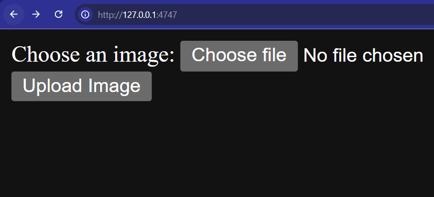

# 🖼️ ASCII Art Generator (Flask App)

Convert your images into **ASCII art** instantly with this simple Flask-based web application.

---

## ✅ Features
- **Upload any image** (JPG/PNG)
- **Convert to ASCII art** using `pywhatkit`
- **Download ASCII art as a `.txt` file**
- **Simple, clean web interface**

---

## 🛠 Tech Stack
- **Python 3**
- **Flask** (Web Framework)
- **PyWhatKit** (Image to ASCII Conversion)
-    **HTML**

---

## 📂 Project Structure

```text
ascii/
├── app.py             # Main Flask application
├── requirements.txt   # Python dependencies
├── Procfile           # For deployment (e.g., Heroku)
├── LICENSE            # License file
├── README.md          # Project documentation
├── .gitignore         # Git ignore file
├── templates/
│   ├── index.html      # Upload page
│   ├── result.html     # Result page
│   ├── script.js       # JavaScript for UI interactions
│   └── style.css       # Custom CSS for styling
└── venv/              # Virtual environment (ignored in Git)
```

## 🚀 Installation & Usage

1. **Clone the repository**
    ```bash
    git clone https://github.com/adilnvm/ascii.git
    cd ascii
    ```

2. **Install dependencies**
    ```bash
    pip install flask pywhatkit
    ```
3. **Run The APP**
    ```bash
    python app.py
    ```
4 **The app will start on:**
    ```
    http://127.0.0.1:4747
    ```

5 **🖼️Upload an Image**



6 **Output in ASCII format will be generated and ASCII will be saved in same folder as a txt file**
    ```
    ../ascii/ascii_art.txt
    ```    
